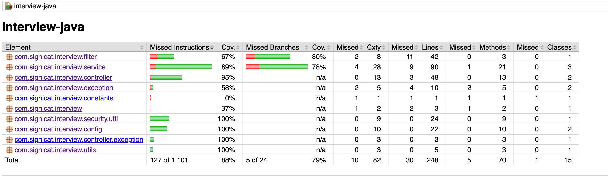

## Project Summary
* ### Project Technical Specs : 
  * Spring Boot : 2.5.5
  * Java : 11

* Open api Link : http://localhost:8080/swagger-ui.html
* Code coverage : 
  

* Application run Manual :
  * To run the app 
    * Either download the soruce code for [github](https://github.com/jcpractice/interview-java.git) or from hard drive
    *Please navigate to the project root directory and execute
      `docker-compose up -d`
      (Additional steps)
  * To build the project
    `./gradlew build`
  * To check the available apis : http://localhost:8080/swagger-ui.html
  * To build the image
    `docker build --build-arg JAR_FILE=build/libs/\*.jar -t handofgod/interview-java:latest .`
  * To push the image
    `docker push handofgod/interview-java:latest`

####The source code can also be found [here] (https://github.com/jcpractice/interview-java.git)
  